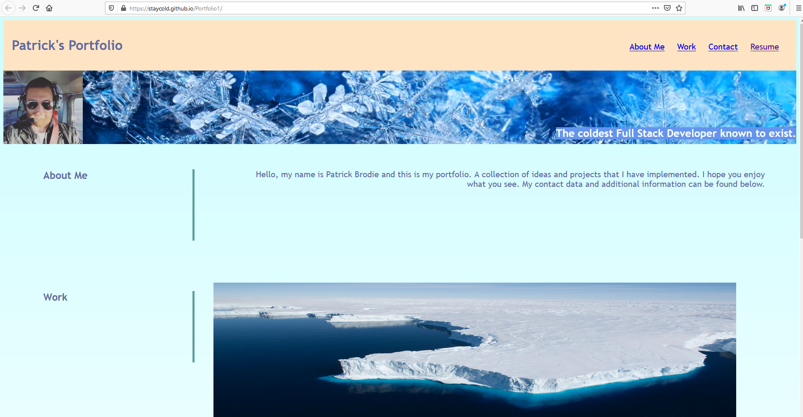

<h1># Portfolio1<h1>

<h4> these were the criteria: <h4>
  <ul>
<li>GIVEN I need to sample a potential employee's previous work</li>
<li>WHEN I load their portfolio
THEN I am presented with the developer's name, a recent photo or avatar, and links to sections about them, their work, and how to contact them</li>
<li>WHEN I click one of the links in the navigation
THEN the UI scrolls to the corresponding section</li>
<li>WHEN I click on the link to the section about their work
THEN the UI scrolls to a section with titled images of the developer's applications</li>
<li>WHEN I am presented with the developer's first application
THEN that application's image should be larger in size than the others</li>
<li>WHEN I click on the images of the applications
THEN I am taken to that deployed application</li>
<li>WHEN I resize the page or view the site on various screens and devices
  THEN I am presented with a responsive layout that adapts to my viewport</li>
    
https://staycold.github.io/Portfolio1/
    
    

